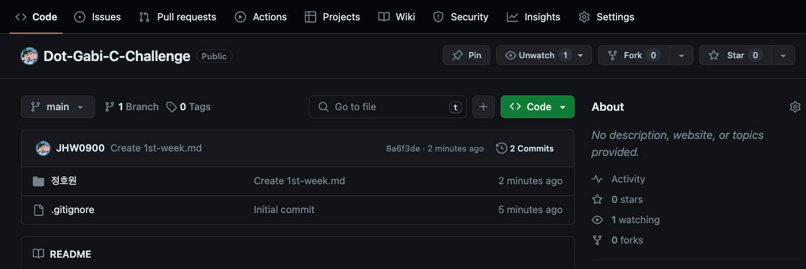
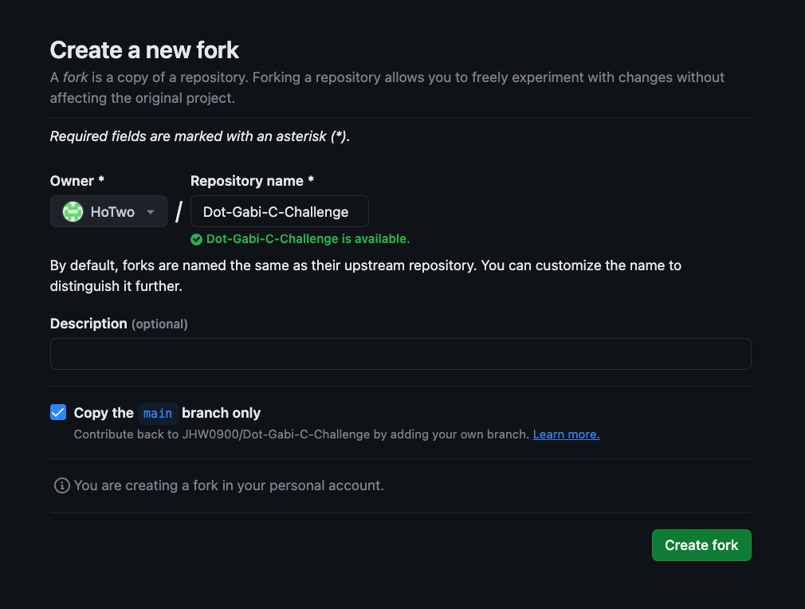
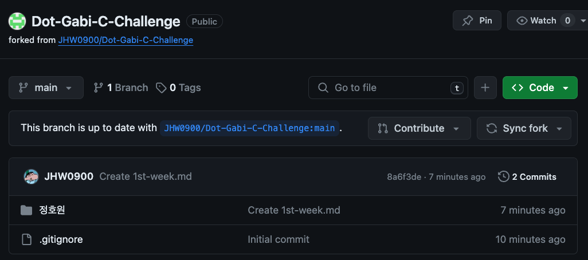
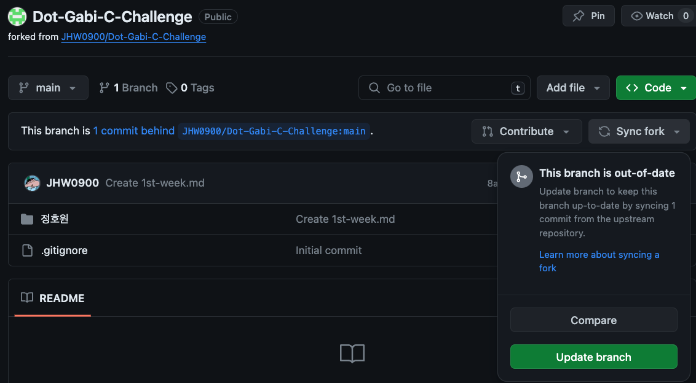
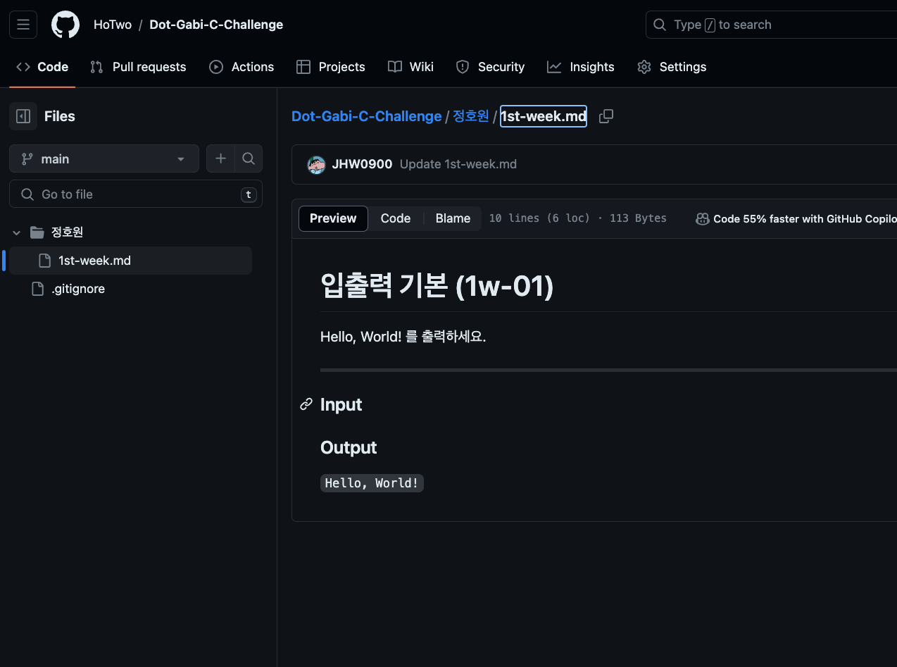
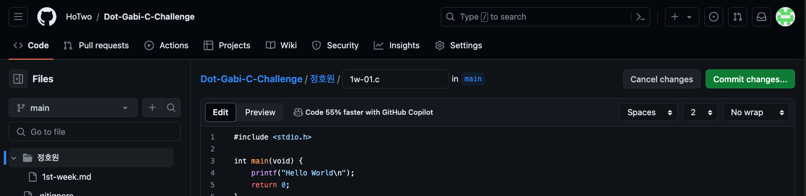
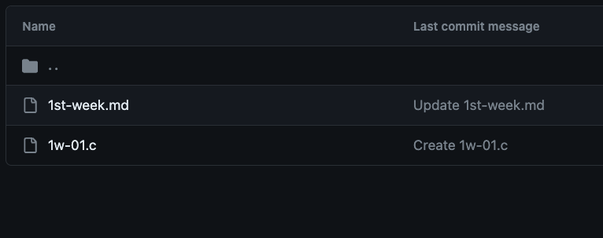
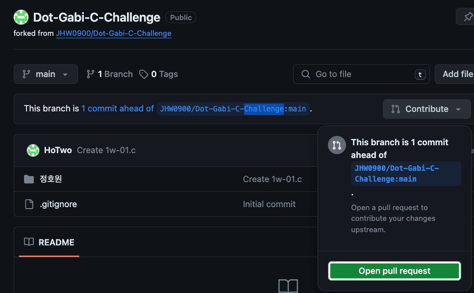
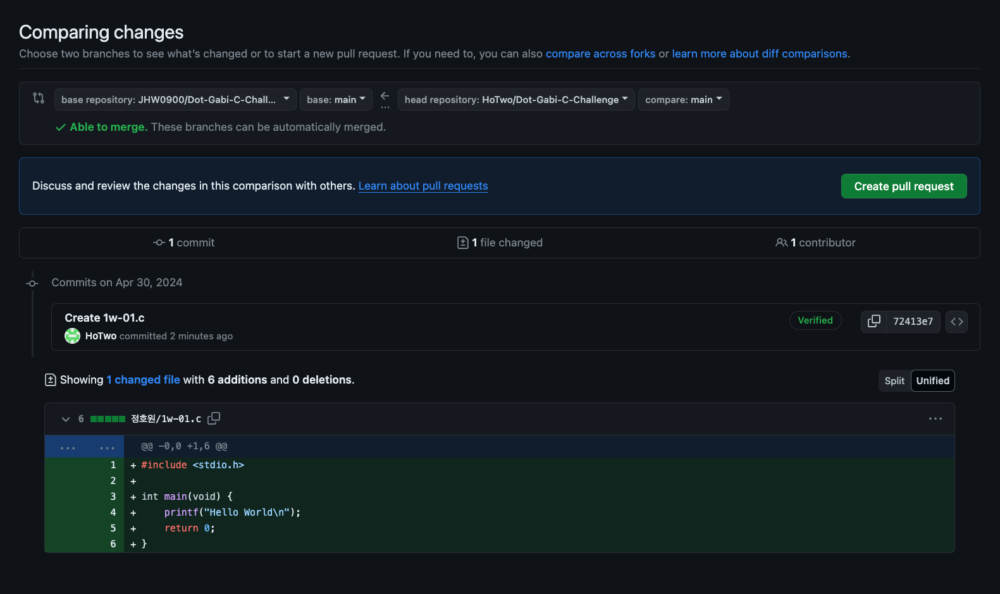

# 과제 제출 요령
https://github.com/JHW0900/Dot-Gabi-C-Challenge/tree/main

1. 위 링크에서 우측 상단의 **Fork** 버튼 클릭

2. 아래의 창에서 **Create fort** 버튼 클릭

3. 기다리면, 아래와 같이 생성되면 **Sync fork** 버튼 클릭

4. **Update branch** 버튼 클릭 - (과제 시작 전, 항상 Update 후 진행)

5. 본인 이름이 적힌 폴더로 들어간 다음, 해당 주차의 과제를 확인

6. 문제 라벨에 맞추어 (Ex. 1w-01.c | 1w-01.cp) 파일을 생성하여 코드를 작성, 작성이 완료된 파일은 동일한 폴더에 커밋 (**Commit changes** 클릭)

7. **Contribute** 버튼을 클릭해, **Open pull request** 버튼을 클릭

8. **Create pull request** 버튼을 클릭하여 제출

---

* Commit message & description 작성 문구는 자유